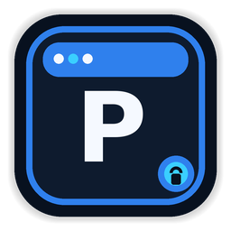
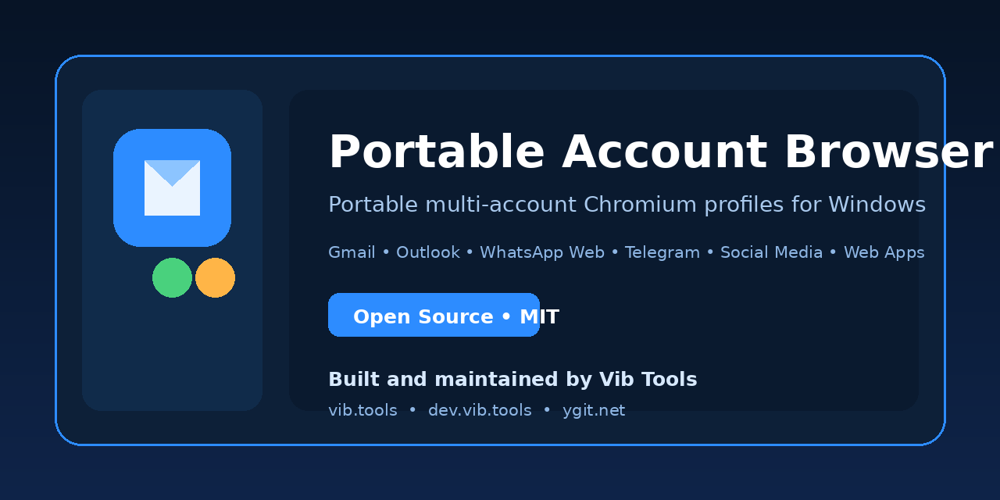

<p align="center">
  
</p>

<h1 align="center">Portable Account Browser</h1>

<p align="center">
  A lightweight, open-source, portable multi-account Chromium browser for
  Gmail, Outlook, WhatsApp Web, Telegram, social media, and everyday web apps on Windows.
</p>

<p align="center">
  <a href="https://github.com/vibtools/PortableAccountBrowser/releases/latest">
    
  </a>
  <a href="https://github.com/vibtools/PortableAccountBrowser/actions/workflows/ci.yml">
    
  </a>
  <a href="LICENSE">
    
  </a>
  
  
</p>

<p align="center">
  <a href="https://github.com/vibtools/PortableAccountBrowser/releases/latest"><strong>Download for Windows</strong></a>
  ·
  <a href="docs/PRIVACY_AND_PORTABILITY.md">Privacy and portability</a>
  ·
  <a href="https://github.com/vibtools/PortableAccountBrowser/issues">Report a bug</a>
  ·
  <a href="https://github.com/vibtools/PortableAccountBrowser/discussions">Discussions</a>
</p>



## Overview

Portable Account Browser launches each account in a separate Chromium
user-data directory. Cookies, Local Storage, IndexedDB, service workers,
preferences, and downloads remain isolated per profile.

It is designed for people who manage several web accounts and need a compact
Windows launcher without mixing sessions between Gmail, Outlook, WhatsApp Web,
Telegram, social platforms, or custom HTTPS applications.

## Key features

- **Isolated account profiles** — each profile has independent cookies and browser storage.
- **Persistent sessions** — websites can remain signed in when their security policies allow it.
- **Portable folder layout** — application runtime and app-managed data stay beside the executable.
- **Single-tab launches** — stale duplicate tabs are not restored when reopening a profile.
- **Mailbox, Messaging, Social Media, Web Apps, and Custom groups.**
- **Clean public builds** — release tooling excludes personal profiles, cookies, history, logs, and downloads.
- **Privacy-first design** — passwords are entered only on the provider website.
- **Compact dark Windows UI** with taskbar icon and DPI-aware executable metadata.
- **Open-source build and verification tooling** with SHA-256 and release privacy checks.

## Supported services

Presets include:

| Category | Services |
|---|---|
| Mailbox | Gmail, Outlook / Microsoft 365, Yahoo Mail, Proton Mail, Zoho Mail, iCloud Mail, AOL Mail, AT&T Mail, Verizon / AOL |
| Messaging | WhatsApp Web, Telegram Web, Messenger, Discord, Slack, Microsoft Teams |
| Social Media | Facebook, Instagram, X, LinkedIn, TikTok, Reddit |
| Web Apps | Google Drive and other everyday web applications |
| Custom | Any valid HTTPS website |

Service names and trademarks belong to their respective owners. This project
is independent and is not endorsed by those services.

## Download

Open the [latest GitHub Release](https://github.com/vibtools/PortableAccountBrowser/releases/latest)
and download:

`PortableAccountBrowser_Windows_x64_v1.3.1_Public.zip`

Verify the download with the supplied SHA-256 files before running it.

### Run

1. Extract the entire ZIP to a writable folder, for example:
   `D:\PortableApps\PortableAccountBrowser`
2. Run `PortableAccountBrowser.exe`.
3. Add a profile.
4. Sign in on the provider's own website.
5. Close browser profiles from the launcher when possible.

Do not run the executable directly from inside the ZIP.

## Build from source

Requirements:

- Windows 10 or Windows 11 x64
- Python 3.10+ x64; Python 3.12 is recommended
- Internet connection during the initial Chromium setup

```bat
setup_dev.bat -Python "D:\App\python312\python.exe"
test_dev.bat
run_dev.bat
```

Create a privacy-clean public build:

```bat
build_publish_ready.bat
```

This default command supports an unsigned release when no Authenticode certificate is available.
All non-signature release checks still run, but Windows SmartScreen may warn users. See
[Publishing](PUBLISHING.md) before distributing the generated artifacts.

## Privacy model

- No telemetry is implemented by the launcher.
- The launcher does not collect account passwords.
- Account profiles are stored locally inside the extracted application folder.
- Public release builds are scanned to exclude personal profile data.
- Existing authenticated sessions copied to another Windows account or device
  may require login or MFA again.

Read [Privacy and Portability](docs/PRIVACY_AND_PORTABILITY.md) and
[Security Policy](SECURITY.md) before distributing modified builds.

## Project architecture

See [Architecture](docs/ARCHITECTURE.md).

## Contributing

Contributions are welcome. Read:

- [Contributing Guide](CONTRIBUTING.md)
- [Code of Conduct](CODE_OF_CONDUCT.md)
- [Security Policy](SECURITY.md)
- [Roadmap](ROADMAP.md)

## Vib Tools

Portable Account Browser is maintained by **Vib Tools**.

- Company: <https://vib.tools/>
- More free and open-source tools: <https://dev.vib.tools/>
- Free subdomain registration: <https://ygit.net>

## License

Released under the [MIT License](LICENSE).

<!--
Search topics: portable browser windows, multi account browser, isolated chromium
profiles, portable Gmail client, WhatsApp Web desktop launcher, Telegram Web
launcher, privacy focused browser profiles, Python Tkinter desktop application.
-->
